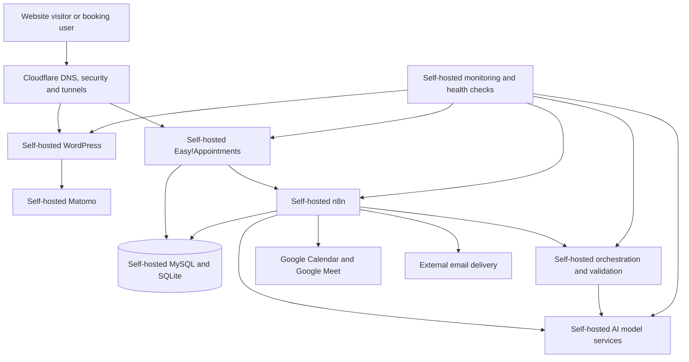

# AI Tuning — Self-Hosted Automation, Web and Private AI Infrastructure

## Project Overview

AI Tuning is an independently developed, pre-revenue technical project created and operated by Aleksandar Momchev through Sandrex Group EOOD in Varna, Bulgaria.

The project demonstrates the design, deployment and operation of a self-hosted technical platform combining:

- WordPress
- private AI infrastructure
- workflow automation
- API integration
- appointment booking
- web analytics
- databases
- monitoring
- validation services
- Linux administration
- containerised applications
- privacy-oriented website operations

The core platform and all owned application services run on infrastructure configured and maintained directly by Aleksandar Momchev.

Selected external services are integrated through APIs or secure network services, but the primary website, booking system, analytics platform, automation platform, databases and AI services are self-hosted.

AI Tuning currently has no paid clients, commercial customer deployments or revenue-generating production installations.

## Public Links

- Website: https://aituning.io
- Booking system: https://book.aituning.io/index.php/?service=1
- GitHub organisation: https://github.com/AITuningEU
- Public contact: hello@aituning.io

## Project Purpose

AI Tuning was created as a practical platform for developing and demonstrating private AI, workflow automation and self-hosted application infrastructure.

The project focuses on:

- keeping core applications under direct infrastructure control
- reducing dependence on externally hosted SaaS platforms
- supporting private AI inference
- integrating business systems through APIs and webhooks
- operating website analytics on self-hosted infrastructure
- creating structured and inspectable automation workflows
- validating data before it reaches external systems
- separating public services from internal infrastructure
- providing GDPR-oriented technical and operational controls
- documenting deployment, maintenance and troubleshooting procedures

## Self-Hosted Platform Summary

The AI Tuning environment includes the following self-hosted components:

- WordPress website
- Easy!Appointments booking platform
- Matomo analytics
- n8n workflow automation
- MySQL databases
- SQLite databases
- Nginx
- PHP-FPM
- Docker
- Docker Compose
- local AI model services
- OpenAI-compatible AI endpoints
- API gateways
- orchestration services
- workflow validators
- monitoring services
- health-check endpoints
- systemd-managed services
- supporting scripts and utilities
- multilingual workflow datasets
- regression and validation tooling

The infrastructure is distributed across several Ubuntu Linux systems with different operational responsibilities.

## Simplified Architecture

This diagram is intentionally simplified and does not expose private addresses, hostnames, ports or internal service paths.

## Multi-Server Infrastructure

AI Tuning uses multiple Ubuntu Linux systems with separated responsibilities.

The environment includes role-based systems for:

### Web, Application and Validation Services

One system supports responsibilities such as:

- WordPress
- Easy!Appointments
- Matomo
- Nginx
- PHP-FPM
- website validation
- supporting web services
- runtime validators
- public application handling
- application databases
- booking services

### Automation Services

A separate system supports:

- self-hosted n8n
- workflow execution
- webhook processing
- database integration
- API integration
- scheduled automation
- workflow state
- SQLite-based operational storage
- execution logging
- automation troubleshooting

### Private AI Runtime

A dedicated GPU-capable system supports:

- local language models
- AI inference
- model containers
- structured generation
- workflow classification
- content processing
- validation assistance
- orchestration workers
- local API endpoints
- GPU workload management

### Controller and Development Services

Another system supports:

- local controller models
- workflow management
- development
- testing
- diagnostics
- emergency routing
- project administration
- infrastructure troubleshooting

Responsibilities are separated so that failure in one service or machine does not require the entire platform to be restarted.

## Linux Administration

The infrastructure is built and maintained on Ubuntu Linux.

Hands-on Linux responsibilities include:

- operating-system installation
- package management
- repository configuration
- users and permissions
- SSH administration
- service configuration
- filesystem management
- storage management
- process inspection
- network troubleshooting
- log inspection
- scheduled jobs
- system updates
- security updates
- system recovery
- resource monitoring
- GPU process management
- service startup and shutdown
- permission troubleshooting
- backup preparation

The troubleshooting approach starts with identifying the affected layer before changing or restarting services.

## WordPress Website

The AI Tuning website is a self-hosted WordPress installation.

The WordPress environment includes:

- Kadence theme
- Rank Math
- Polylang
- WP Super Cache
- custom page structures
- multilingual content
- service pages
- sector pages
- pricing pages
- blog content
- portfolio and demonstration pages
- booking links
- contact functionality
- legal and privacy pages
- technical SEO
- structured metadata
- internal linking
- caching
- performance optimisation
- accessibility considerations
- consent management

The site presents private AI and automation services for areas such as:

- legal operations
- customer support
- healthcare-related workflows
- fintech
- public-sector use cases
- multilingual support
- private knowledge systems
- workflow automation

These are service capabilities and designed use cases. They are not presented as completed paid client deployments.

## WordPress Administration Responsibilities

The WordPress work includes:

- installation
- domain configuration
- subdomain configuration
- theme configuration
- plugin configuration
- page creation
- navigation
- technical SEO
- metadata
- schema-related configuration
- multilingual setup
- caching
- troubleshooting
- backups
- updates
- permissions
- PHP integration
- Nginx integration
- publishing
- legal-page management
- consent integration
- performance checks
- uptime checks

The environment is not hosted through a fully managed WordPress platform.

## Self-Hosted Matomo Analytics

AI Tuning uses self-hosted Matomo as its primary standard website analytics platform.

Matomo runs on the project’s own infrastructure rather than using Google Analytics as the main website analytics service.

The Matomo deployment provides direct control over:

- analytics application hosting
- analytics database
- tracking configuration
- user access
- data retention
- reporting
- privacy settings
- website integration
- consent behaviour
- maintenance
- updates
- service availability
- log access

The objective is to keep normal website analytics processing on infrastructure under the project’s control.

Matomo-related work includes:

- installation
- server configuration
- database configuration
- WordPress integration
- tracking-code deployment
- consent-aware activation
- privacy configuration
- report access
- maintenance
- updates
- performance troubleshooting
- service monitoring
- health verification
- replacement of externally hosted standard analytics

## Consent and Privacy Controls

The website includes consent and privacy controls for technologies that may process visitor information.

The privacy structure includes:

- cookie categories
- consent handling
- analytics consent
- privacy-policy documentation
- cookie-policy documentation
- data-processing information
- legal notices
- accessibility information
- third-party service disclosures
- analytics disclosures
- data-minimisation principles

Self-hosted Matomo is integrated into this consent structure.

The platform is described as GDPR-oriented rather than making an unsupported claim that every possible use automatically guarantees legal compliance.

## Self-Hosted Booking Platform

The AI Tuning booking system runs at:

https://book.aituning.io/index.php/?service=1

The booking platform is a self-hosted Easy!Appointments installation running on AI Tuning infrastructure.

It is not a fully hosted scheduling SaaS service.

The booking environment supports:

- appointment services
- availability configuration
- customer booking forms
- appointment dates and times
- timezone information
- customer contact details
- booking status
- booking notes
- service selection
- database storage
- webhook events
- integration with n8n

Booking services include consultation, implementation and support appointment types.

## Booking Data Flow

The self-hosted booking system stores appointment and customer information in its own database.

A booking event triggers the self-hosted n8n platform through a webhook.

The automation then:

1. Receives the booking event.
2. Reads the booking identifier.
3. Reads the customer identifier.
4. Queries the self-hosted MySQL booking database.
5. Retrieves the customer and booking information.
6. Combines webhook and database data.
7. Normalises the data into one internal payload.
8. Creates a calendar event.
9. Adds the customer as an attendee.
10. Requests a Google Meet link.
11. Extracts the calendar event identifier.
12. Extracts the meeting link.
13. Prepares confirmation-email variables.
14. Sends the booking confirmation.
15. Creates the required internal follow-up calendar event.

## Appointment Workflow

The appointment automation demonstrates integration between:

- self-hosted Easy!Appointments
- self-hosted MySQL
- self-hosted n8n
- webhook processing
- Google Calendar
- Google Meet
- SMTP email delivery

The workflow handles data such as:

- appointment identifier
- customer identifier
- first name
- last name
- email
- phone information
- company
- website
- country
- timezone
- booking start
- booking end
- booking status
- location
- notes
- calendar event identifier
- meeting link

The complete workflow export is not published because it contains internal identifiers, credential references and operational details.

## Booking Confirmation Automation

After the calendar event is created, the workflow prepares and sends a branded confirmation email.

The email includes:

- customer name
- appointment date and time
- timezone
- duration
- location
- Google Meet link
- instructions for joining
- rescheduling information
- introductory call topics
- company branding

The workflow also preserves operational values such as:

- calendar event ID
- Google Meet link
- booking start
- booking end
- attendee email
- execution status

The appointment workflow is active and processes the sequence from webhook reception through database lookup, calendar creation, email confirmation and internal follow-up. :contentReference[oaicite:0]{index=0}

## Booking Reliability Considerations

The booking workflow is designed around several reliability requirements:

- required-field validation
- stable booking identifiers
- webhook-data validation
- database lookup verification
- email validation
- start-time validation
- end-time validation
- timezone handling
- calendar-response validation
- meeting-link verification
- confirmation-email status
- failure-stage identification
- execution logging

A more advanced version can also use the booking identifier as an idempotency key to prevent duplicate calendar events when a webhook is retried.

## Self-Hosted n8n

n8n runs on AI Tuning’s own server infrastructure.

It is the primary automation platform for integrating:

- websites
- booking systems
- databases
- REST APIs
- webhooks
- email
- calendars
- WordPress
- local AI services
- monitoring services
- validation services
- structured data processes

The n8n environment is not operated through n8n Cloud.

## n8n Workflow Capabilities

The project demonstrates hands-on n8n work involving:

- webhook triggers
- scheduled triggers
- HTTP requests
- REST APIs
- JSON
- JavaScript Code nodes
- database queries
- field mapping
- conditional routing
- merge operations
- loop processing
- waits and controlled delays
- retries
- error branches
- status updates
- execution identifiers
- duplicate prevention
- record locking
- data validation
- WordPress REST API integration
- Google Calendar integration
- SMTP email
- local AI API calls
- execution summaries
- operational logging

## API Integration

AI Tuning includes practical API integration work involving:

- REST APIs
- webhooks
- JSON request bodies
- JSON response parsing
- API authentication
- HTTP Basic Authentication
- OAuth-based services
- local API endpoints
- OpenAI-compatible endpoints
- WordPress REST API
- Google Calendar API
- internal service APIs
- booking webhooks
- monitoring endpoints

Integration work includes:

- building request payloads
- validating responses
- normalising fields
- handling missing values
- checking HTTP status
- preserving identifiers
- parsing nested JSON
- managing authentication
- detecting temporary failures
- distinguishing validation failures from service failures
- documenting corrective actions

## Databases

The project uses self-hosted databases for different application and workflow responsibilities.

### MySQL

MySQL supports applications such as:

- WordPress
- Easy!Appointments
- Matomo
- supporting application data

Work includes:

- application database configuration
- database connectivity
- SQL queries
- record lookup
- field mapping
- permission troubleshooting
- backup considerations
- application integration

### SQLite

SQLite is used where lightweight operational state or workflow storage is appropriate.

It supports or can support:

- workflow state
- internal status records
- job information
- local automation data
- execution-related storage
- development and testing

## Nginx

Nginx is used as the main web-server and reverse-proxy layer.

Responsibilities include:

- WordPress traffic
- booking-system traffic
- Matomo traffic
- subdomain routing
- reverse-proxy routing
- HTTPS handling
- public endpoint routing
- internal service forwarding
- access logs
- error logs
- request troubleshooting
- service separation
- security headers
- controlled exposure

Public requests are routed to the correct application without directly exposing unnecessary internal services.

## PHP-FPM

PHP-FPM supports PHP applications including:

- WordPress
- Easy!Appointments
- Matomo

PHP-FPM-related work includes:

- pool configuration
- socket or upstream configuration
- file permissions
- process troubleshooting
- Nginx integration
- application errors
- performance checks
- restart and recovery procedures

## Cloudflare

Cloudflare provides an external security and traffic-management layer in front of the self-hosted infrastructure.

Cloudflare is used for:

- DNS
- HTTPS
- traffic routing
- secure tunnels
- public service exposure
- protection from direct origin exposure
- caching
- bot protection
- request filtering
- domain management
- subdomain management

Cloudflare Tunnels allow selected self-hosted services to be reachable without directly publishing internal server addresses or opening unnecessary inbound ports.

Cloudflare is an external infrastructure integration. It is not described as a self-hosted component.

## Docker and Docker Compose

Docker and Docker Compose are used for containerised services.

Responsibilities include:

- Compose configuration
- service definitions
- container networking
- environment configuration
- persistent volumes
- dependency management
- startup
- shutdown
- container restarts
- image updates
- health checks
- log inspection
- resource troubleshooting
- service isolation

The containerised approach provides:

- repeatable deployment
- dependency isolation
- clearer service ownership
- easier log inspection
- controlled networking
- targeted service restarts

## systemd

systemd manages selected services that require reliable startup and supervision.

systemd work includes:

- unit files
- automatic startup
- service dependencies
- restart policies
- status checks
- journal inspection
- controlled shutdown
- recovery after reboot
- environment configuration
- failure diagnosis

## Private AI Infrastructure

AI Tuning includes private AI services running on local GPU-enabled infrastructure.

The AI environment supports work with open-source model families including:

- Llama
- Qwen
- Mistral

Models are used for experimentation and structured workflow tasks.

The project includes experience with:

- local inference
- GPU model execution
- model containers
- OpenAI-compatible endpoints
- prompt construction
- structured JSON output
- model routing
- task classification
- multilingual responses
- validation
- local API calls
- inference monitoring
- GPU memory management
- model startup and shutdown
- service health checks

The purpose of the private AI environment is to provide greater control over:

- model selection
- prompt handling
- output handling
- request logging
- infrastructure access
- data location
- runtime configuration
- workflow integration

## AI Gateway and Routing

The AI infrastructure includes gateway and routing patterns for sending requests to appropriate local model services.

Routing responsibilities include or have included:

- model aliases
- planner selection
- local-controller selection
- fallback behaviour
- confidence-based escalation
- schema validation
- structured response requirements
- retry control
- failure routing
- health verification

The project has tested a multi-model governance approach in which lightweight local models handle simpler tasks while larger models are reserved for more complex or failed cases.

This architecture remains an internal technical project rather than a commercial production deployment.

## Orchestration

AI Tuning includes work on a self-hosted orchestration layer for coordinating automation and specialised services.

The orchestration design includes:

- job creation
- job status
- controlled execution
- validation
- commit-style actions
- timeouts
- failure states
- worker routing
- schema gates
- planner responses
- task verification
- transaction-oriented processing

The aim is to prevent uncontrolled actions and require structured, verifiable results.

## Specialised Services and Workers

The internal environment includes or has tested specialised services for tasks such as:

- reading
- search
- authentication support
- extraction
- moderation
- form processing
- file transfer
- commenting
- page watching
- crawling
- profile processing
- network inspection
- schema validation
- social posting
- chat widgets
- checkout
- maps
- visual processing
- scheduling
- PDF snapshots
- Lighthouse checks
- screenshots
- search aggregation

These are internal technical capabilities and are not described as completed customer deployments.

## Multilingual Workflow Data

AI Tuning includes structured multilingual workflow datasets.

Languages include:

- English
- German
- French
- Spanish
- Italian
- Polish
- Bulgarian

Workflow categories include areas such as:

- greetings
- appointment booking
- pricing
- contact handling
- out-of-scope requests
- safety
- language switching
- follow-up handling
- intake
- routing

The dataset work demonstrates:

- structured examples
- language consistency
- workflow-specific rules
- output constraints
- validation
- category routing
- regression cases
- multilingual behaviour testing

## Workflow Validation

The project uses deterministic validation where possible instead of relying only on generated text.

Validation patterns include:

- schema validation
- required-field checks
- value-type checks
- record-count checks
- enum validation
- structured JSON validation
- duplicate detection
- identifier matching
- execution verification
- blocking errors
- warnings
- regression tests
- golden test cases
- acceptance checks

The purpose is to prevent malformed or incomplete data from advancing through automation workflows.

## Content and Publishing Automation

AI Tuning includes content-operation workflows for structured article preparation and publishing.

The workflow approach can include:

- source selection
- topic normalisation
- article planning
- section generation
- metadata preparation
- link validation
- content assembly
- WordPress REST API publishing
- post-write verification
- error recording

The technical focus is on structured processing, validation and controlled publication rather than uncontrolled automatic posting.

## Monitoring and Health Checks

The infrastructure includes monitoring and health-check procedures for core services.

Checks include:

- website availability
- booking-system availability
- Matomo availability
- n8n availability
- Docker container status
- Linux service status
- HTTP health endpoints
- API response status
- AI model endpoint status
- reverse-proxy status
- database connectivity
- GPU availability
- workflow execution results
- disk and memory conditions
- log errors

## Troubleshooting Method

A typical investigation follows the service chain:

1. Confirm the public endpoint.
2. Check DNS and Cloudflare routing.
3. Check tunnel status.
4. Check Nginx.
5. Check PHP-FPM or the relevant application service.
6. Check Docker containers.
7. Check systemd services.
8. Check the application database.
9. Check n8n execution history.
10. Check API responses.
11. Check local AI endpoints.
12. Check system resources.
13. Review logs.
14. Restart only the affected service where possible.
15. Verify the result after the corrective action.

The preferred approach is targeted recovery rather than restarting the whole environment.

## Reliability Principles

The project applies practical reliability principles including:

- service separation
- health checks
- structured logs
- explicit statuses
- execution identifiers
- record locking
- duplicate prevention
- bounded retries
- failure preservation
- verification after write operations
- manual review paths
- controlled restarts
- rollback awareness
- documented recovery steps
- separation of temporary and permanent failures

## Security Principles

Security practices include:

- HTTPS
- restricted administrative access
- SSH-based server administration
- private repositories for infrastructure configuration
- separation of public and internal services
- Cloudflare Tunnels
- credential storage outside public code
- environment-based configuration
- limited public service exposure
- operating-system updates
- application updates
- access logging
- error logging
- consent-aware analytics
- self-hosted standard analytics
- data minimisation
- EU-based infrastructure
- sanitised public documentation

## GDPR-Oriented Architecture

The platform is designed around privacy and data-control principles relevant to EU operations.

These include:

- self-hosted core applications
- self-hosted analytics
- controlled data locations
- reduced reliance on third-party analytics
- access restrictions
- consent controls
- privacy documentation
- data-minimisation practices
- controlled external integrations
- separation of internal services
- logging and auditability
- defined data-processing boundaries

The architecture can support GDPR-oriented deployments, but legal compliance always depends on the full operational context and the way a system is used.

## External Integrations

The core AI Tuning platform is self-hosted.

The following external services are connected where required.

### Cloudflare

Used for:

- DNS
- HTTPS
- security
- tunnels
- traffic routing

### Google Calendar and Google Meet

Used by the booking workflow for:

- calendar-event creation
- attendees
- meeting links
- consultation scheduling

### Email Delivery

An external email or SMTP service is used for sending:

- booking confirmations
- operational notifications
- business email

These are integrations connected to the self-hosted platform. They are not the hosting environment for WordPress, Matomo, Easy!Appointments, n8n, databases or private AI services.

## Backups and Maintenance

Operational maintenance includes:

- application updates
- WordPress updates
- plugin updates
- Linux updates
- container updates
- configuration backups
- database-backup planning
- service verification
- log review
- health checks
- restart testing
- recovery documentation
- storage monitoring
- permission checks

## Documentation

The project uses technical documentation for:

- architecture
- service responsibilities
- ports and routing
- workflow rules
- validation rules
- health checks
- regression tests
- troubleshooting
- deployment status
- acceptance status
- phase status
- operational handoff
- service inventory

Sensitive documents and production configuration remain private.

## Personal Contribution

AI Tuning is designed, configured, tested, maintained and documented personally by Aleksandar Momchev.

Responsibilities include:

- infrastructure planning
- Ubuntu Linux administration
- server installation
- WordPress deployment
- WordPress administration
- Matomo deployment
- Matomo configuration
- Easy!Appointments deployment
- booking-system configuration
- MySQL configuration
- SQLite use
- n8n deployment
- n8n workflow design
- webhook integration
- REST API integration
- Google Calendar integration
- Google Meet integration
- SMTP email automation
- Docker deployment
- Docker Compose configuration
- Nginx configuration
- PHP-FPM configuration
- Cloudflare configuration
- Cloudflare Tunnel configuration
- systemd service management
- local AI deployment
- AI endpoint configuration
- orchestration
- validation
- monitoring
- health checks
- technical SEO
- consent configuration
- privacy-oriented analytics
- troubleshooting
- testing
- regression checks
- documentation
- maintenance

No employees, contractors or paid client teams are represented as having performed this work.

## Project Status and Boundaries

AI Tuning is an active independent technical project.

It is:

- self-hosted
- pre-revenue
- independently maintained
- used for technical development and demonstration
- not a paid client implementation
- not evidence of completed commercial customer deployments
- not presented as legal certification
- not presented as guaranteed regulatory compliance

The project demonstrates practical technical capability rather than a history of paid consulting engagements.

## Public Documentation Boundaries

This public overview intentionally excludes:

- passwords
- API keys
- OAuth tokens
- SMTP credentials
- database passwords
- private IP addresses
- internal hostnames
- private service URLs
- internal ports
- webhook identifiers
- credential identifiers
- database identifiers
- complete SQL schemas
- complete workflow exports
- internal server paths
- `.env` contents
- personal booking data
- visitor analytics data
- private logs
- security configuration
- full production configuration

## Professional Relevance

AI Tuning demonstrates hands-on experience relevant to roles involving:

- automation engineering
- n8n development
- API integration
- implementation support
- technical support
- Linux administration
- junior infrastructure
- Docker
- WordPress operations
- technical SEO
- web analytics
- Matomo
- privacy-oriented analytics
- self-hosted applications
- booking automation
- databases
- monitoring
- private AI infrastructure
- workflow validation
- AI operations
- technical troubleshooting
- technical documentation
