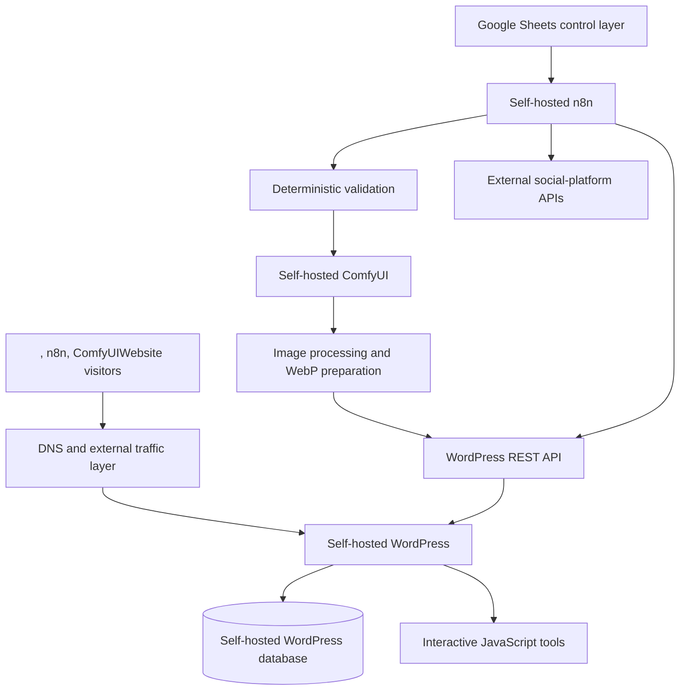

# Eat With Rhythm — Self-Hosted WordPress, Interactive Tools and Automated Publishing Platform

## Project Overview

Eat With Rhythm is an independently developed, pre-revenue digital food-content and website-automation project created by Aleksandar Momchev and Zlatina Manolova.

The project combines:

- a self-hosted WordPress website
- interactive front-end decision tools
- practical food-content architecture
- responsive website design
- technical SEO
- structured article operations
- self-hosted n8n automation
- Google Sheets workflow control
- deterministic content validation
- self-hosted ComfyUI image generation
- automated image processing
- WordPress REST API publishing
- social-content preparation and distribution
- monitoring
- error-state recording
- privacy and content-safety boundaries

The public website and core owned application services run on infrastructure configured and maintained directly by Aleksandar Momchev.

External services such as Google Sheets and social-media APIs are connected to the self-hosted platform through authenticated integrations.

Eat With Rhythm currently has no paid clients, commercial customer deployments, paid subscribers or project revenue.

## Public Links

- Website: https://eatwithrhythm.com
- Start Here: https://eatwithrhythm.com/start-here/
- Eat With Me Today: https://eatwithrhythm.com/eat-with-me-today/
- Recipes: https://eatwithrhythm.com/recipes/
- Budget Eating: https://eatwithrhythm.com/budget-eating/
- Food On The Go: https://eatwithrhythm.com/food-on-the-go/
- Reset After Food Chaos: https://eatwithrhythm.com/reset-after-food-chaos/
- About: https://eatwithrhythm.com/about/
- Contact: https://eatwithrhythm.com/contact/
- Join: https://eatwithrhythm.com/join/

## Project Purpose

Eat With Rhythm was created for busy people who want less food chaos, more structure and easier food decisions in ordinary life.

The project is built around:

- ordinary food
- realistic meal choices
- simple daily anchors
- fallback meals
- budget-aware options
- food available outside the home
- low-energy days
- delayed meals
- long gaps between meals
- calm recovery after chaotic eating

The core message is:

> Less food chaos. More rhythm.

The platform does not promote:

- strict dieting
- food purity
- punishment
- detox language
- luxury wellness
- guaranteed weight loss
- medical treatment
- body-transformation promises
- shame-based food decisions

## Self-Hosted Platform Summary

The Eat With Rhythm environment includes the following self-hosted components:

- WordPress website
- WordPress database
- Nginx web-server configuration
- PHP-FPM
- self-hosted n8n
- local automation scripts
- validation logic
- workflow execution services
- ComfyUI image generation
- GPU-based media processing
- WordPress media handling
- workflow monitoring
- health checks
- supporting Linux services

The core website, automation and media-generation environment runs on self-managed infrastructure.

## External Integrations

Selected external services are connected where required.

These include:

- Google Sheets as the structured operational control layer
- social-media APIs
- Telegram
- Facebook
- Instagram
- Threads
- X
- Pinterest
- potential email-list providers
- external DNS or traffic-management services

These are integrations connected to the project.

They are not the hosting environment for WordPress, n8n, ComfyUI or the core application stack.

## Simplified Architecture

This public diagram intentionally excludes private addresses, hostnames, ports, server paths, credentials, document identifiers and internal endpoints.

## Team Responsibilities

Eat With Rhythm combines technical and food-content responsibilities.

### Aleksandar Momchev

Aleksandar manages the digital and technical side of the project.

Responsibilities include:

- website architecture
- self-hosted WordPress
- Linux infrastructure
- WordPress configuration
- page construction
- front-end tools
- JavaScript logic
- workflow design
- n8n
- API integration
- Google Sheets architecture
- WordPress REST API integration
- ComfyUI integration
- media automation
- publishing automation
- technical SEO
- monitoring
- troubleshooting
- documentation
- maintenance

### Zlatina Manolova

Zlatina leads the practical food and visual direction.

Responsibilities include:

- practical recipe direction
- food combinations
- cooking by instinct
- visual food presentation
- food-image direction
- social presentation
- practical real-life food context
- tone and usability from the reader’s perspective

The project combines food knowledge, real-life meal logic and technical systems.

## Self-Hosted WordPress Website

Eat With Rhythm runs on a self-hosted WordPress installation.

The public website is not hosted through a fully managed website-building platform.

The WordPress environment includes:

- GeneratePress
- custom page layouts
- responsive design
- reusable page components
- custom JavaScript
- interactive decision tools
- dynamic content areas
- blog categories
- article templates
- legal pages
- contact functionality
- technical SEO
- internal linking
- structured metadata
- media management
- accessibility considerations
- performance management
- publishing workflows

## WordPress Administration

WordPress responsibilities include:

- installation
- server configuration
- domain configuration
- page creation
- theme configuration
- plugin management
- navigation
- reusable sections
- custom shortcodes
- CSS adjustments
- JavaScript integration
- media-library management
- user and author configuration
- categories
- tags
- slugs
- excerpts
- featured images
- internal linking
- technical SEO
- updates
- backups
- performance checks
- error investigation
- publishing verification

## Website Information Architecture

The website is organised around the problems readers face during ordinary days.

The main content areas include:

- Home
- Start Here
- Eat With Me Today
- Recipes
- Rhythm Guides
- Budget Eating
- Food On The Go
- Reset After Food Chaos
- About
- Join
- Contact
- privacy and terms pages

This structure helps users enter through their immediate need instead of requiring them to understand the entire project first.

## Home Page

The home page introduces the central project idea:

> Easy meals for busy people who want less food chaos.

It connects users to:

- the Start Here tool
- daily meal ideas
- practical guides
- recipes
- budget eating
- food-on-the-go support
- reset guidance
- project information
- email-list preparation

The home page explains how skipped meals, delayed lunch and long gaps can make later food decisions more difficult.

## Start Here Tool

The Start Here page contains an interactive JavaScript decision tool.

It helps visitors select a practical starting point without creating a strict diet identity.

The tool includes stages for:

1. choosing how to begin;
2. optionally selecting a food style;
3. selecting what the day needs;
4. receiving a practical next move.

## Start Paths

The user can begin through one of two paths:

- start with a food style;
- receive a simple start without choosing a food style.

This avoids forcing every user into a fixed category.

## Food-Style Options

The tool presents practical meal-style paths such as:

- more meat
- some meat
- eggs and dairy
- mostly plant-based food

These are practical navigation choices rather than permanent identities or medical dietary classifications.

## Today-Need Options

The tool can adapt the result according to needs such as:

- a proper meal
- a lighter version
- a budget version
- an on-the-go version
- a reset version

## Start Here Results

The result structure includes:

- best next meal
- fallback
- simple swap
- how to use the option today
- rhythm note
- related page
- additional result options
- restart control

The page also provides ordinary links when JavaScript is disabled.

## Progressive Disclosure

The interactive tools use progressive disclosure.

This means:

- the user answers one question at a time;
- irrelevant choices are hidden;
- the result appears only after required answers are provided;
- the interface avoids presenting every possible option at once.

This reduces visual complexity and makes the tool easier to use on mobile devices.

## Eat With Me Today

The Eat With Me Today page provides a practical daily food planner.

It is built around the day the user is actually having rather than an ideal weekly meal plan.

The planner produces a structured daily direction including:

- breakfast
- lunch
- fallback
- dinner
- simple swaps
- quick-recipe guidance
- budget note
- rhythm note

## Daily Planner Questions

The interactive planner asks questions in stages.

The current structure includes:

1. where the user will eat;
2. how much preparation effort is realistic;
3. which useful foods are available;
4. the main pressure affecting the meal;
5. what the user needs today.

## Eating-Location Options

Possible environments include:

- home
- work
- travelling or outside all day
- buying food nearby

## Effort Options

The planner recognises different energy and time levels:

- no cooking
- approximately ten minutes
- approximately twenty minutes
- more time available

## Available-Food Options

The user can select available groups such as:

- eggs or dairy
- meat or fish
- beans or lentils
- bread, rice, potatoes or pasta
- ready food or leftovers
- need to buy something

## Main-Pressure Options

The recommendation can adapt to pressures such as:

- very little time
- tight budget
- low energy
- limited ingredients

## Daily Planner Output

The result can contain:

- next meal anchor
- fallback
- later direction
- selected meal
- required ingredients
- three-step preparation
- no-cooking alternative
- ingredient substitution
- explanation of why the option supports the day’s rhythm
- another option
- ability to change answers
- restart control

## State Between Tools

The website can carry selected Start Here choices into the Eat With Me Today planner.

This reduces repeated questions and creates a more connected user journey.

The transferred state can include information such as:

- selected starting path
- food style
- today’s need

## Recipes

The Recipes section is designed around practical use rather than functioning as a generic recipe archive.

Recipes include information such as:

- recipe title
- intended situation
- preparation time
- cooking time
- total time
- servings
- budget level
- effort level
- US measurements
- UK and EU metric measurements
- ingredients
- method
- fast version
- budget version
- substitutions
- serving suggestions
- rhythm note

## Recipe Examples

Public recipes include ordinary options such as:

- eggs with potatoes and tomato
- yogurt, oats and banana
- tuna and cucumber sandwich
- lentil soup with bread
- rice with beans and yogurt

The food is intentionally ordinary and repeatable.

## Recipe Design Principles

Recipe content follows several principles:

- ordinary ingredients
- low complexity
- realistic preparation
- budget awareness
- substitution options
- leftovers
- no-cook alternatives
- portable versions
- practical serving context
- no strict food ideology

## Budget Eating

The Budget Eating section addresses food structure when money is limited.

The page is built around the idea that the cheapest single item is not always the most useful choice for the day.

The content considers:

- cost per usable portion
- repeat value
- how well a meal supports the next part of the day
- low-cost meal anchors
- leftovers
- no-cook fallbacks
- food bought outside the home
- ordinary supermarket ingredients

## Budget Decision Tool

The Budget Eating page includes an interactive decision tool.

The tool can help with needs such as:

- cheapest useful breakfast
- lunch that holds longer
- dinner that creates leftovers
- no-cook fallback
- food-on-the-go budget option

The result structure includes:

- best move
- example foods
- fallback
- simple swap
- rhythm note

## Food On The Go

The Food On The Go section addresses days shaped by:

- work
- transport
- errands
- supermarkets
- bakeries
- cafés
- petrol stations
- small shops
- limited carrying space
- changing meal times

The page focuses on useful combinations rather than perfect food.

Examples include:

- yogurt and fruit
- boiled eggs and bread
- tuna and crackers
- cheese sandwich and fruit
- shop-based meal combinations

## Reset After Food Chaos

The reset section helps visitors make one calm next food decision after a difficult or disorganised food day.

It avoids:

- punishment
- restriction
- detox language
- guilt
- waiting until Monday
- dramatic restart plans

## Reset Decision Tool

The interactive reset tool asks what happened.

Examples include:

- ate more than planned
- skipped meals and became too hungry
- ate random snacks all day
- ate outside or while travelling
- felt tired and low-energy

The result provides:

- best next meal
- fallback
- simple swap
- rhythm note
- related recipes
- links to daily ideas
- restart control

## Content Boundaries

Eat With Rhythm is not presented as:

- medical nutrition treatment
- a replacement for a registered professional
- a therapeutic eating-disorder service
- a personalised weight-loss programme
- a strict diet
- a guaranteed body-transformation method
- emergency support

The website asks users not to submit urgent, medical or sensitive personal information through the contact form.

## Contact System

The contact page uses a structured form.

The form requests only information required to respond, such as:

- name
- email
- reason for the message
- message

The page provides categories for:

- recipe or rhythm questions
- website issues
- collaboration or media requests
- privacy or data requests

## Join Page

The Join page is prepared for future email-list integration.

It describes intended email content such as:

- meal ideas
- budget swaps
- fallback meals
- food-on-the-go support
- reset guidance
- practical rhythm notes

The live page currently identifies the signup form as a provider-integration preview.

It should not be represented as a completed active subscriber system until the final email provider has been connected and tested.

## Content Categories

The website’s content model includes areas such as:

- daily meal ideas
- recipes
- rhythm guides
- budget eating
- food on the go
- reset after food chaos
- practical food support
- project information

## Technical SEO

The project includes hands-on technical SEO work involving:

- page titles
- meta descriptions
- URL slugs
- headings
- article excerpts
- categories
- tags
- internal links
- related-content links
- image alt text
- image titles
- structured-data media
- canonical page organisation
- indexability checks
- link-response checks
- page templates
- content hierarchy
- search-intent mapping

## Structured Content Operations

The automated publishing system uses structured records instead of treating each article as one unstructured block.

An article can be represented through separate records for:

- queue configuration
- article sections
- SEO
- sources
- internal links
- media
- authorship
- validation
- workflow configuration
- WordPress controls
- social posts
- social-platform configuration

## Self-Hosted n8n

The Eat With Rhythm publishing pipeline runs on a self-hosted n8n installation.

It is not operated through n8n Cloud.

n8n coordinates:

- Google Sheets
- article selection
- record locking
- validation
- media preparation
- SSH operations
- ComfyUI
- image downloads
- image conversion
- WordPress REST API
- social-platform preparation
- status recording
- error handling

## Workflow Name

The documented workflow is:

> EWR Article Pipeline v31 — Deterministic Preflight

The complete workflow export is not published because it contains internal identifiers, credential references, document identifiers, service configuration and private infrastructure details.

## Workflow Triggers

The pipeline can be started through configured workflow triggers.

The trigger stage leads into date handling and article-queue selection.

## Article Queue

Google Sheets acts as an operational control layer.

The queue contains fields such as:

- article ID
- publish date
- status
- priority
- article type
- content pillar
- content series
- working title
- topic
- primary keyword
- secondary keywords
- search intent
- audience
- reader problem
- brand angle
- reader outcome
- content requirements
- language
- WordPress category
- WordPress tags
- slug
- SEO title
- meta description
- excerpt
- safety status
- attempt count
- execution ID
- error stage
- error message
- lock time
- start time
- completion time

## Article Selection

The workflow selects one eligible article.

Eligibility rules include:

- article status must be approved;
- publish date must be due;
- the article must not already be locked;
- article ID must be present;
- publish date must have a valid format.

Eligible articles are sorted by:

1. priority;
2. publish date;
3. article ID.

Only one article proceeds through a workflow run.

## Queue Locking

After selecting an article, the workflow updates the queue record.

It records:

- processing status
- incremented attempt count
- n8n execution ID
- lock timestamp
- start timestamp

## Lock Verification

The workflow then reads the record again.

It verifies that:

- the status is processing;
- the article ID matches;
- the execution ID matches;
- the lock timestamp exists;
- the start timestamp exists.

This reduces the risk of duplicate executions processing the same article.

## Structured Sheet Reads

After the lock is verified, the workflow reads the required article records from separate Google Sheets tabs.

These include:

- article sections
- article sources
- article links
- article media
- article authorship
- article validation
- SEO records
- workflow configuration
- WordPress publishing controls

## Canonical Article Pack

The workflow combines the separate records into one canonical article pack.

The pack can contain:

- queue data
- SEO data
- ordered sections
- sources
- links
- media
- authorship
- validation
- workflow configuration
- WordPress publishing controls
- record counts
- blocker list
- warning list

This creates one stable internal structure for later workflow stages.

## Deterministic Preflight

The workflow uses deterministic rules before allowing publication.

The result includes:

- `prewrite_valid`
- blocker count
- warning count
- blockers
- warnings
- record counts
- WordPress publishing controls
- canonical article pack

An invalid article does not continue into publication.

## Validation Categories

Pre-write validation includes areas such as:

- article identity
- queue state
- execution lock
- configuration
- sections
- SEO
- sources
- internal links
- media
- authorship
- approval state
- WordPress configuration
- article structure
- word count
- prohibited wording
- final-action sections

## Section Validation

The workflow checks the article-section structure.

Checks include:

- required section IDs
- section order
- duplicate sections
- missing sections
- approved prose
- word counts
- expected final sections
- FAQ structure
- final-action structure

## Source Validation

Source records can be checked for:

- source ID
- article ID
- approval status
- source type
- required fields
- duplicate records
- content relationship

Only approved source records proceed into the article pack.

## Internal-Link Validation

Link records are checked for areas such as:

- link ID
- approval status
- expected article relationship
- valid target
- HTTP response
- confirmed indexability
- placement
- duplicate records

The WordPress article builder expects a controlled number of approved links.

Links can be assigned as:

- inline next-step links
- related-content links

## Media Roles

Each article requires three structured media records:

- featured image
- structured-data image in 4:3 format
- structured-data image in 1:1 format

## Media Dimensions

The expected media dimensions are:

- featured image: 1600 × 900, 16:9
- structured-data image: 1200 × 900, 4:3
- structured-data image: 1200 × 1200, 1:1

## Media Validation

Media checks include:

- media ID
- role
- filename
- format
- dimensions
- aspect ratio
- alt text
- caption
- placement section
- placement rule
- duplicate media ID
- expected row count
- approval state

## Media Runtime

The media stage prepares three image-generation jobs.

Before starting ComfyUI, the workflow can:

- clear competing GPU processes;
- start the required Docker Compose service through SSH;
- inspect container state;
- wait for the HTTP endpoint;
- verify readiness;
- collect diagnostic information when startup fails.

## Self-Hosted ComfyUI

ComfyUI runs on self-managed GPU infrastructure.

The workflow uses it to generate the article’s required media.

The media-generation process includes:

1. building the generation job;
2. creating the prompt body;
3. submitting the prompt;
4. receiving the prompt ID;
5. initialising polling state;
6. waiting between checks;
7. polling ComfyUI history;
8. confirming completion;
9. extracting the generated filename;
10. downloading the image.

## GPU Resource Management

The workflow includes explicit GPU-management steps.

These may include:

- checking GPU availability
- clearing previous workloads
- starting ComfyUI only when required
- waiting for service health
- freeing GPU resources
- collecting logs after failure

This reduces conflicts between self-hosted AI services using the same GPU hardware.

## Image Download Verification

After ComfyUI completes, the workflow verifies:

- media ID exists;
- prompt ID is known;
- history contains the expected job;
- the job completed;
- an image filename exists;
- an image type exists;
- downloaded binary data exists;
- the MIME type represents an image.

## WebP Preparation

Generated images are processed before WordPress upload.

The workflow prepares:

- final filename
- final MIME type
- WebP-compatible output
- binary upload field
- WordPress upload metadata
- target Sheet record
- actual generated filename

## WordPress Media Upload

The workflow uploads each image through the WordPress REST API.

The media workflow includes:

1. prepare upload data;
2. convert or prepare the final image;
3. upload WordPress media;
4. normalise the API result;
5. update WordPress media metadata;
6. update the article-media Sheet row;
7. continue to the next required image.

## WordPress Media Metadata

Uploaded-media metadata can include:

- title
- alt text
- caption
- media role
- WordPress media ID
- WordPress media URL
- upload status
- validation status

## Media Re-Read

After all media uploads, the workflow reads the media records again.

It verifies that the required WordPress media IDs and URLs have been stored before article assembly begins.

## Article Assembly Pack

The workflow builds an article assembly pack from:

- approved article prose
- SEO data
- authorship data
- approved sources
- approved links
- verified media
- WordPress configuration
- article-validation records

## Assembly Validation

The article assembly stage confirms that the required article components are present and internally consistent.

Invalid assembly is routed to a controlled failure branch.

The queue is updated with:

- blocked status
- failure stage
- error summary
- execution information
- cleared lock where appropriate

## WordPress HTML Builder

After assembly validation, the workflow creates WordPress-ready HTML.

The builder handles:

- article title
- headings
- article sections
- approved prose
- internal links
- related links
- featured media
- inline media
- captions
- author information
- FAQ content
- final-action content
- sources
- structured presentation

## WordPress HTML Validation

Before writing to WordPress, the generated HTML is checked again.

Validation can confirm:

- HTML exists
- required sections are present
- media is correctly assigned
- link count is correct
- featured media is valid
- WordPress category IDs exist
- WordPress tags exist where required
- author ID is valid
- publishing mode is supported

## WordPress Publishing Modes

The workflow supports controlled write modes such as:

- draft only
- publish after validation

The selected mode is read from workflow configuration rather than being hard-coded into every workflow run.

## WordPress REST API Write

The workflow sends the validated article payload to the self-hosted WordPress REST API.

The payload can include:

- title
- slug
- status
- HTML content
- excerpt
- author
- categories
- tags
- featured media

## WordPress Result Verification

The workflow verifies the WordPress response.

Checks can include:

- response count
- WordPress post ID
- post status
- slug
- categories
- tags
- featured media
- author
- expected content markers
- final URL

A successful HTTP request alone is not treated as sufficient proof of correct publication.

## Queue Publication Update

After WordPress verification, the workflow updates the article queue.

The update can include:

- published status
- WordPress post ID
- final URL
- completion time
- cleared lock
- cleared error fields
- execution information

## Failure States

The queue preserves distinct failure stages.

Examples include:

- pre-write blocked
- media failure
- assembly failure
- HTML validation failure
- WordPress write failure
- post-write verification failure
- social publishing failure

## Error Recording

Error records can include:

- article ID
- status
- error stage
- error message
- blocker count
- execution ID
- start time
- completion time
- lock state

This makes failed records easier to inspect and retry.

## Social Campaign Preparation

After WordPress output is verified, the workflow can build social-campaign records.

Supported platform records include:

- Telegram
- Facebook
- Instagram
- Threads
- X
- Pinterest
- TikTok
- YouTube

## Configuration-Controlled Social Scope

The presence of a platform record does not mean every platform is published during every workflow run.

Platform behaviour is controlled through configuration records.

Possible runtime actions include:

- live publish
- draft only
- prepare only
- blocked
- deferred

The current live-publishing scope is validated before platform posting begins.

## Social Post Records

A social-post record can contain:

- post ID
- campaign ID
- article ID
- WordPress post ID
- article title
- article excerpt
- article URL
- platform
- post type
- post text
- image role
- image URL
- scheduled time
- scheduled offset
- posting mode
- post status
- approval status
- published URL
- validation status
- error message
- creation time
- update time

## Platform-Specific Media

Platform rows can use different media roles.

Image-required platforms may include:

- Telegram
- Facebook
- Instagram
- Pinterest

Draft-oriented platforms can use prepared media and scripts without being published automatically.

## Social Validation

Before a social post is sent, the workflow can check:

- platform configuration
- template ID
- validation profile
- runtime action
- post text
- article URL
- image URL
- publication mode
- existing publication state
- approval state
- required platform fields

## Social Publication Results

After a platform action, the workflow can record:

- published status
- published URL
- platform response
- validation status
- error message
- update timestamp

## JavaScript in n8n

JavaScript Code nodes are used extensively for:

- selecting articles
- date validation
- sorting
- lock verification
- text normalisation
- required-field validation
- duplicate detection
- record grouping
- canonical-pack construction
- blocker creation
- warning creation
- media-job preparation
- ComfyUI response parsing
- WordPress payload preparation
- HTML construction
- result verification
- queue-update preparation
- social-post preparation
- platform routing

## Reliability Principles

The workflow applies practical reliability principles including:

- one article per execution
- stable article identifiers
- execution-specific locks
- lock verification
- attempt counters
- exact record-count checks
- deterministic validation
- blockers and warnings
- approved-source requirements
- HTTP link checks
- media-role enforcement
- media-dimension enforcement
- WordPress response verification
- explicit failure states
- preserved error messages
- configuration-controlled publishing
- post-write validation
- targeted retries
- separation of preparation and publication

## Security and Privacy

Security practices include:

- self-hosted core applications
- HTTPS
- restricted administration
- SSH with private-key authentication
- credentials stored in n8n credential management
- private infrastructure repositories
- no credentials in public documentation
- no raw workflow exports in the public portfolio
- no public Google Sheets identifiers
- no private internal addresses
- no private server paths
- no personal user submissions in the portfolio
- no private analytics data
- sanitised examples

## Content Safety

The project maintains clear content boundaries.

The website and publishing workflow avoid unsupported claims involving:

- guaranteed weight loss
- treatment outcomes
- medical nutrition
- diagnosis
- detox claims
- punishment
- shame
- strict food rules
- universal health promises

## Troubleshooting Method

A typical investigation can follow this sequence:

1. Check the article queue.
2. Confirm the article is approved and due.
3. Inspect the article lock.
4. Confirm the execution ID.
5. review n8n execution history.
6. identify the failed validation stage.
7. inspect blocker and warning records.
8. verify required Google Sheets rows.
9. verify media configuration.
10. check GPU availability.
11. check ComfyUI health.
12. inspect image-generation history.
13. verify WordPress media uploads.
14. inspect article assembly.
15. verify generated HTML.
16. inspect the WordPress REST response.
17. confirm the final WordPress post.
18. verify social-platform configuration.
19. inspect recorded publication results.
20. rerun only after the cause has been corrected.

## Monitoring and Maintenance

Operational work includes:

- WordPress updates
- plugin updates
- theme updates
- Linux updates
- PHP checks
- Nginx checks
- n8n updates
- Docker service checks
- ComfyUI checks
- GPU checks
- database backups
- configuration backups
- workflow testing
- queue inspection
- log review
- failed-execution review
- link checks
- media checks
- page testing
- mobile testing
- JavaScript testing
- performance checks
- accessibility checks

## Documentation

The project uses documentation for:

- website architecture
- page structure
- content categories
- article templates
- SEO fields
- publishing rules
- Google Sheets schemas
- workflow configuration
- media requirements
- validation rules
- failure states
- platform configuration
- troubleshooting
- maintenance

## Personal Contribution

Aleksandar Momchev personally designed, configured, tested and maintained the technical platform.

Responsibilities include:

- project architecture
- self-hosted WordPress deployment
- Ubuntu Linux administration
- Nginx configuration
- PHP-FPM configuration
- WordPress configuration
- GeneratePress configuration
- page construction
- navigation
- responsive design
- interactive JavaScript tools
- WordPress shortcodes
- front-end state handling
- technical SEO
- metadata
- categories and tags
- internal linking
- Google Sheets data architecture
- self-hosted n8n
- workflow design
- deterministic validation
- JavaScript Code nodes
- API integration
- SSH automation
- Docker integration
- ComfyUI integration
- GPU workflow management
- image generation
- image processing
- WebP preparation
- WordPress REST API integration
- WordPress media upload
- media metadata
- article assembly
- HTML generation
- publication verification
- queue-state management
- social-platform integration
- error handling
- testing
- monitoring
- troubleshooting
- documentation
- maintenance

Zlatina Manolova provides the food, recipe, visual and practical-reader direction.

No paid client team, employee, contractor or commercial customer deployment is represented as having performed this work.

## Project Status and Boundaries

Eat With Rhythm is:

- an active independent project
- self-hosted
- pre-revenue
- independently maintained
- a practical food-content platform
- a WordPress project
- an interactive web-tool project
- an automation and publishing project
- not a medical platform
- not a personalised diet service
- not a weight-loss programme
- not a clinical service
- not a completed commercial customer deployment

The email-list interface and some social integrations may remain staged until final provider configuration and end-to-end verification are complete.

## Public Documentation Boundaries

This public overview intentionally excludes:

- passwords
- API keys
- OAuth tokens
- social-platform access tokens
- SSH credentials
- private keys
- WordPress credentials
- Google Sheets document identifiers
- credential identifiers
- private IP addresses
- internal hostnames
- internal ports
- private service URLs
- webhook identifiers
- server usernames
- internal server paths
- Docker Compose paths
- ComfyUI internal endpoints
- complete workflow exports
- raw Google Sheets data
- unpublished article content
- private contact-form submissions
- private logs
- production security configuration

## Professional Relevance

Eat With Rhythm demonstrates hands-on experience relevant to roles involving:

- WordPress operations
- WordPress administration
- website implementation
- front-end interaction design
- JavaScript
- responsive web design
- technical SEO
- content architecture
- n8n workflow automation
- Google Sheets automation
- REST API integration
- WordPress REST API
- structured data operations
- queue processing
- record locking
- duplicate prevention
- deterministic validation
- error handling
- workflow monitoring
- Linux administration
- Docker
- SSH automation
- self-hosted applications
- ComfyUI
- GPU workflow management
- image processing
- media automation
- automated publishing
- social-media API integration
- technical troubleshooting
- technical documentation
