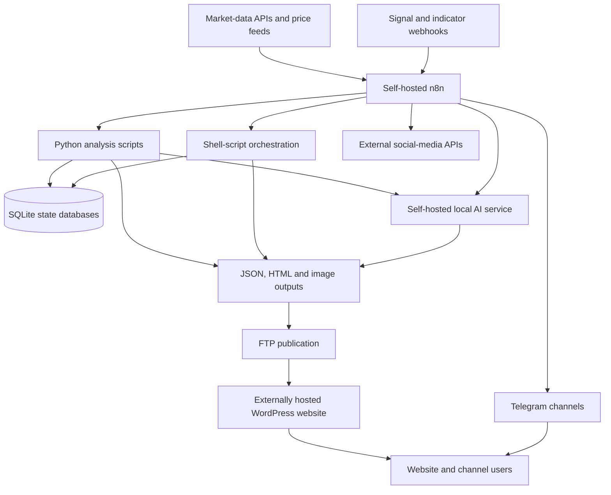

# WaveFibs — Automated Market Data, Technical Analysis and Signal Distribution Platform

## Project Overview

WaveFibs is an independently developed, non-commercial technical project created and maintained by Aleksandar Momchev in Varna, Bulgaria.

The project combines:

- cryptocurrency market-data processing
- automated technical-analysis pipelines
- multi-timeframe signal matrices
- webhook processing
- Python analysis scripts
- shell-script orchestration
- self-managed n8n automation
- SQLite state management
- local AI-assisted market summaries
- automated chart generation
- website publication
- Telegram alert distribution
- social-media publishing experiments
- WordPress administration
- technical SEO
- consent and legal-page management

WaveFibs is a personal technical and educational project.

It has no paid clients, commercial customer deployments, managed trading accounts, customer funds or automated exchange-order execution.

The platform publishes informational market analysis and technical signals. It does not provide personalised financial advice, portfolio management, custody, automated trading or copy trading.

## Public Links

- Website: https://wavefibs.com
- Technical-analysis hub: https://wavefibs.com/crypto-technical-analysis/
- Real-time alerts hub: https://wavefibs.com/real-time-alerts/
- Bitcoin analysis: https://wavefibs.com/crypto-technical-analysis/btcusdt/
- Bitcoin signal matrix: https://wavefibs.com/real-time-alerts/btc-trading-signals-matrix/

## Hosting Model

WaveFibs uses a hybrid architecture.

The public WordPress website is hosted externally rather than on the AI Tuning self-hosted web infrastructure.

The automation and data-processing backend is separately operated on self-managed Linux infrastructure.

### Externally Hosted Components

The externally hosted website environment includes:

- WordPress
- public pages
- technical-analysis pages
- real-time signal-matrix pages
- blog content
- public JSON and HTML data files
- images and charts
- legal pages
- consent management
- externally hosted website analytics

### Self-Managed Backend Components

The backend automation environment includes:

- self-hosted n8n
- Ubuntu Linux
- Python scripts
- shell scripts
- SQLite databases
- webhook endpoints
- market-data processing
- technical-indicator calculations
- signal normalisation
- signal-state tracking
- local AI model services
- HTML and JSON generation
- chart and image processing
- FTP publication
- Telegram distribution
- monitoring and troubleshooting

The website is therefore not described as fully self-hosted, but a substantial part of the data-processing and automation backend runs on infrastructure configured and maintained directly by Aleksandar Momchev.

## Project Purpose

WaveFibs was created to explore and implement an end-to-end market-data and publishing system.

The project demonstrates how market information can move through a structured pipeline:

1. Receive or retrieve market data.
2. Normalise symbols, prices, timeframes and timestamps.
3. Calculate technical indicators and market conditions.
4. classify directional and pattern-based signals.
5. store operational state.
6. generate structured summaries.
7. create website-ready JSON, HTML and images.
8. publish updated files to the website.
9. distribute selected alerts through Telegram.
10. preserve notification and position state to prevent duplicates.

The project focuses on technical automation rather than trade execution.

## Simplified Architecture



This public diagram intentionally excludes credentials, private addresses, internal hostnames, ports, database paths, webhook identifiers and server paths.

## Public Website

WaveFibs uses WordPress as its public content and presentation layer.

The website includes:

- homepage market dashboard
- crypto technical-analysis hub
- real-time alerts hub
- individual asset-analysis pages
- individual signal-matrix pages
- market news and insights
- blog articles
- Telegram-channel directory
- donation information
- contact information
- privacy and consent controls
- risk disclosures
- accessibility information
- legal and community pages

## Website Navigation and Information Architecture

The main website structure includes areas for:

- Home
- Blog
- Daily Analysis
- Trading Signals
- News and Insights
- Telegram Channels
- Donations and project support
- About
- Contact
- legal and compliance information

The structure separates:

- market overview
- asset-level analysis
- signal matrices
- educational content
- news
- community channels
- legal information

## Technical-Analysis Hub

The technical-analysis hub provides public analysis pages for six principal cryptocurrency pairs:

- BTC/USDT
- ETH/USDT
- SOL/USDT
- XRP/USDT
- ADA/USDT
- DOGE/USDT

The pages provide or are designed to provide:

- 1-hour market outlooks
- live or generated charts
- trend direction
- momentum
- EMA information
- MACD information
- support and resistance
- psychological zones
- volatility context
- divergences
- imbalance information
- scenario-based summaries
- risk considerations
- updated timestamps

The public pages are refreshed through automated backend processes rather than requiring every section to be updated manually.

## Real-Time Alerts Hub

The alerts area presents a multi-asset view of market conditions.

It includes:

- asset selection
- timeframe selection
- strong-signal filtering
- bull-versus-bear pressure
- trend information
- momentum
- volatility
- divergences
- potential reversal information
- links to detailed matrix pages
- Telegram alert links

## Multi-Timeframe Signal Matrix

The matrix system processes directional information across several timeframes.

The primary public timeframes include:

- 1 hour
- 2 hours
- 4 hours
- 1 day

The matrix presents values such as:

- bull power
- bear power
- directional signal
- update time
- momentum state
- volatility
- divergence
- trend
- psychological zones
- imbalance zones

## Automated Matrix Workflow

The active matrix workflow runs a Python batch-processing script.

The workflow then:

1. Executes the signal-matrix calculation.
2. reads the structured script output.
3. parses the output as JSON.
4. groups rows by market symbol.
5. creates a separate website file for each supported asset.
6. routes each file to its correct publication branch.
7. removes the previous public file.
8. waits between publication operations.
9. uploads the replacement JSON file by FTP.

The uploaded workflow publishes separate bull/bear-power files for:

- Bitcoin
- Ethereum
- Solana
- XRP
- Cardano
- Dogecoin

This allows the public website to read a small asset-specific JSON file rather than requiring the WordPress page to run the market calculations itself.

## Matrix Publication Pattern

The simplified publication pattern is:

```text
Python batch calculation
        ↓
Structured JSON output
        ↓
Group records by symbol
        ↓
Create asset-specific JSON
        ↓
Route by filename
        ↓
Remove previous public file
        ↓
Upload replacement through FTP
        ↓
Website matrix reads updated data
```

## Technical-Analysis Processing

The detailed BTC workflow demonstrates a multi-stage technical-analysis pipeline.

The workflow is triggered through a webhook and coordinates several Python scripts.

The processing stages include:

- market-candle retrieval
- indicator calculation
- volatility calculation
- momentum processing
- trend processing
- session and psychological-zone processing
- imbalance-zone processing
- EMA-cross detection
- divergence detection
- bull-versus-bear-power calculation
- vector-imbalance export
- structured summary generation
- local AI analysis
- HTML construction
- chart generation
- Telegram preparation
- website publication

## Market Candle Retrieval

The analysis pipeline begins by retrieving or preparing market candles for the selected symbol.

The candle data provides inputs such as:

- open
- high
- low
- close
- volume
- timestamps
- timeframe

The data is then used by later indicator and analysis scripts.

## Indicator Processing

The uploaded BTC workflow coordinates scripts for areas including:

- MACD
- ATR
- EMA relationships
- EMA 50 crossing
- bull/bear power
- psychological levels
- session levels
- volatility-compression zones
- vector imbalance
- divergences
- technical summaries

The scripts separate calculation responsibilities instead of placing all logic inside one very large n8n Code node.

This design provides:

- clearer troubleshooting
- independent script testing
- easier replacement of one calculation
- better responsibility separation
- easier command-line verification
- reusable outputs

## MACD and Momentum

The analysis pipeline uses MACD-related values to evaluate momentum.

Processed information may include:

- MACD value
- signal value
- histogram
- histogram direction
- bullish momentum
- bearish momentum
- momentum changes
- MACD divergence

The processed values are converted into structured fields that can be reused by the website, Telegram and AI-summary branches.

## EMA Analysis

EMA processing includes:

- EMA 50
- EMA 200
- relative position
- trend direction
- cross detection
- price relationship to moving averages

These values support the trend and scenario sections of the public analysis.

## ATR and Volatility

ATR-related processing is used to describe current volatility conditions.

The system can distinguish between conditions such as:

- lower volatility
- normal volatility
- elevated volatility
- rapid expansion

Volatility is treated as context rather than as an independent instruction to trade.

## Divergence Detection

The analysis pipeline includes divergence detection.

The workflow processes:

- bullish divergence
- bearish divergence
- MACD divergence
- symbol
- timeframe
- detection time
- recent divergence state

The results are normalised so they can be included in:

- technical-analysis summaries
- website cards
- Telegram messages
- signal-routing decisions

## Psychological and Session Zones

The project includes processing for psychological and session-related price zones.

This may include:

- recent highs
- recent lows
- round-number levels
- session boundaries
- potential reaction zones
- market-control areas

The objective is to add structured context around raw indicator values.

## Volatility-Compression Zones

The technical-analysis workflow includes processing for volatility-compression or related zone conditions.

The workflow uses separate scripts to identify and prepare these values for downstream use.

The output is incorporated into the market summary and website display.

## Bull and Bear Power

Bull-versus-bear calculations are used both in the technical-analysis pages and the matrix system.

The output can represent:

- relative buying pressure
- relative selling pressure
- directional balance
- dominant side
- neutral conditions
- timeframe-specific state

## Vector Imbalance

The backend includes a vector-imbalance export stage.

The exported data is used as another structured input for the technical-analysis summary.

This demonstrates orchestration of multiple calculated data sources rather than relying on a single indicator.

## Structured Technical Summary

After the calculations are completed, the workflow builds a structured technical summary.

The summary can include sections such as:

- trend analysis
- momentum analysis
- market sentiment
- divergence
- psychological zones
- imbalance candle
- imbalance zone
- volatility
- support and resistance
- current price
- generation timestamp

The information is converted into a consistent format before being sent to the AI-analysis step.

## Local AI-Assisted Analysis

The WaveFibs backend includes use of a locally operated language-model service for structured market commentary.

The detailed BTC workflow calls a local OpenAI-compatible endpoint using a Qwen model.

The prompt requests a controlled scenario-based analysis containing sections such as:

- current technical scenario
- trend
- momentum
- sentiment
- divergence
- key levels
- volatility
- risk assessment
- summary
- actionable recommendations

The model is used to turn structured technical inputs into readable commentary.

It does not independently retrieve market data or execute trades.

## AI Output Controls

The model prompt uses explicit formatting rules.

These include:

- required section order
- controlled labels
- limited formatting
- specified bullet format
- restricted output style
- maximum output size
- scenario-based rather than guaranteed language

The resulting text is then processed again before publication.

## AI Service Management

The technical-analysis workflow includes service-management operations for the local AI runtime.

These operations can include:

- starting the model service
- checking availability
- sending the analysis request
- parsing the response
- stopping or freeing GPU resources
- continuing to later publication steps

This prevents an AI model from occupying GPU resources permanently when it is only needed for scheduled analysis.

## Chart Generation

The BTC workflow includes automated chart creation.

The chart branch can:

1. submit a chart request to an external chart-generation API;
2. receive a generated chart location;
3. download the chart as binary data;
4. write the image to temporary storage;
5. read the image for processing;
6. cover or replace unwanted visual elements;
7. apply WaveFibs branding;
8. prepare the final image for Telegram or website use.

## Image Processing

Image-processing nodes are used for operations such as:

- drawing over an existing area
- adding WaveFibs branding
- setting text
- controlling text location
- choosing a font
- preserving PNG output
- preparing binary data for Telegram

This demonstrates file and binary-data handling inside n8n.

## Website HTML Generation

The workflow builds HTML components for technical-analysis pages.

Generated output includes cards for areas such as:

- trend
- momentum
- sentiment
- divergence
- volatility
- imbalance
- psychological zones

The HTML-generation step:

- escapes unsafe characters
- handles missing values
- applies status-dependent presentation
- converts structured values into website-ready markup
- produces a reusable HTML snippet

## Scenario Analysis Publication

The AI-generated analysis is converted from structured plain text into website-ready HTML.

The conversion process includes:

- extracting model response text
- removing accidental HTML
- normalising whitespace
- detecting required sections
- converting approved bold labels
- converting bullets
- escaping unsupported content
- adding update metadata
- producing a final HTML fragment

## FTP Website Publication

The public WaveFibs website is hosted externally.

The automation publishes data and content to that hosting environment through FTP.

Publication tasks include:

- deleting outdated generated files
- waiting for file operations
- uploading current JSON
- uploading technical-analysis HTML
- uploading summary HTML
- replacing website data files
- preserving predictable public filenames

The workflow does not publish raw database files, internal logs or complete n8n exports.

## BTC Technical-Analysis Outputs

The BTC workflow produces or supports outputs including:

- technical-analysis HTML
- summary HTML
- structured signal JSON
- chart image
- Telegram-formatted analysis
- website-formatted analysis
- current timestamp
- current symbol and timeframe metadata

## Multi-Asset Analysis

The public website exposes dedicated analysis for:

- BTC
- ETH
- SOL
- XRP
- ADA
- DOGE

The uploaded detailed workflow documents the BTC implementation.

The public pages demonstrate the same general output model across the six principal assets:

- chart
- trend
- momentum
- support and resistance
- technical scenario
- risk context
- update timestamp

## Signal-Ingestion Workflow

WaveFibs includes an active signal-ingestion and position-state workflow.

The internally named premium-signal workflow receives structured events through a webhook.

The workflow supports multiple USDT pairs, including principal and extended-market assets.

Examples present in the workflow include:

- BTCUSDT
- ETHUSDT
- SOLUSDT
- XRPUSDT
- ADAUSDT
- DOGEUSDT
- LINKUSDT
- AAVEUSDT
- SUIUSDT
- FETUSDT
- TRXUSDT
- SEIUSDT
- WIFUSDT
- HYPEUSDT
- AEROUSDT
- VIRTUALUSDT
- additional configured pairs

The presence of an asset in the workflow does not mean a live signal is always published for it.

## Signal Normalisation

Incoming payloads may use different field names and formats.

The workflow converts them into a common structure containing fields such as:

- symbol
- signal
- price
- timeframe
- timeframe in minutes
- timestamp
- timestamp in milliseconds
- signal colour
- pattern shape
- directional side
- signal tier
- normalised direction
- webhook-received time

## Timeframe Normalisation

The JavaScript processing converts timeframe formats into consistent minute-based values.

Examples include:

- minute values
- hourly values
- daily values
- weekly values

This allows downstream scripts and storage operations to use one comparable timeframe representation.

## Timestamp Normalisation

Incoming timestamps may be supplied as:

- Unix seconds
- Unix milliseconds
- numeric strings
- missing values

The workflow detects the available format and converts it into a consistent Unix-seconds representation.

When a timestamp is unavailable, a controlled fallback may use the workflow time.

## Signal Types

The workflow recognises or processes several signal concepts, including:

- BUY signals
- SELL signals
- tiered directional signals
- divergence
- star patterns
- triangle patterns
- bullish colour states
- bearish colour states

Pattern and directional signals are separated so they can trigger different processing branches.

## Pattern Routing

The workflow determines whether an event represents:

- a directional entry signal
- an opposite-direction closure
- a take-profit pattern
- a divergence
- a non-actionable event

Star and triangle patterns can be routed to take-profit processing, while explicit BUY and SELL events can be used for directional position-state logic.

## Per-Symbol Routing

The large signal workflow includes separate routing branches for configured symbols.

Delays are staggered between branches to reduce simultaneous command and webhook activity.

This helps avoid:

- request bursts
- overlapping command execution
- excessive downstream traffic
- simultaneous notification delivery

## Shell-Script Integration

The n8n workflows call shell scripts for state-management operations.

The scripts include patterns for:

- inserting raw signals
- creating position records
- closing records on opposite signals
- updating take-profit status
- emitting unnotified open signals
- emitting unnotified take-profit events
- marking notifications as sent

Shell scripts isolate database and state-transition logic from the visual n8n workflow.

## SQLite Position State

WaveFibs uses SQLite for lightweight signal and position-state management.

The database records can contain operational values such as:

- internal position ID
- symbol
- direction
- timeframe
- entry price
- stop level
- take-profit level
- entry time
- exit price
- exit time
- open or closed status
- profit percentage
- holding duration
- notification state
- Telegram message identifier
- Telegram chat identifier
- notification time
- last-update time

This is internal informational signal tracking.

It is not an exchange account, brokerage ledger or customer trading account.

## Opposite-Signal Processing

When a new directional signal opposes an existing tracked direction, the workflow can:

1. identify the relevant symbol and timeframe;
2. locate an open internal position record;
3. calculate or record the closing event;
4. mark the previous position as closed;
5. record the closing reason;
6. pass the event to the next notification stage.

The closing reason can identify an opposite signal as the trigger.

## Take-Profit Processing

Star and triangle events can be routed into take-profit logic.

The processing can:

- identify the relevant open position
- determine the take-profit stage
- record the take-profit event
- calculate a profit percentage
- calculate holding duration
- prepare a take-profit notification
- mark the take-profit notification as delivered

## Open-Signal Notification Workflow

A separate active workflow handles unnotified open-signal events.

The workflow:

1. requests unnotified open records;
2. parses command output;
3. checks that the event type is correct;
4. builds a structured Telegram message;
5. sends the message;
6. captures the Telegram response;
7. stores the message and chat identifiers;
8. records the notification time;
9. marks the database record as notified;
10. verifies the updated database state.

## Take-Profit Notification Workflow

Another active workflow handles unnotified take-profit events.

The workflow:

1. requests pending take-profit notifications;
2. parses JSON output;
3. filters for take-profit events;
4. formats the symbol and timeframe;
5. formats prices and profit values;
6. creates the Telegram message;
7. adds website or channel links;
8. sends the notification;
9. stores delivery identifiers;
10. marks the event as delivered.

## Duplicate-Notification Prevention

The notification workflows use database state to reduce duplicate messages.

The relevant controls include:

- `notified` status
- internal position identifier
- event type
- Telegram message identifier
- Telegram chat identifier
- sent timestamp
- last-update timestamp

Records are selected for delivery only when they have not already been marked as notified.

## Telegram Distribution

Telegram is an important publication layer for WaveFibs.

The automation supports channels for areas such as:

- general WaveFibs updates
- free signals
- technical analysis
- market overviews
- take-profit notifications
- large-order or whale alerts
- premium-labelled internal signal streams
- announcements

Telegram messages can include:

- symbol
- timeframe
- direction
- entry
- target
- stop level
- take-profit stage
- profit percentage
- holding duration
- technical-analysis summary
- chart link
- website link
- inline buttons

The presence of premium-labelled workflows does not establish that paid subscribers or commercial subscriptions exist.

## Market Overview Workflow

WaveFibs includes a broader market-overview workflow.

The uploaded version of this workflow is currently inactive, so it should be described as developed or tested rather than as a continuously active production process.

The workflow is designed to aggregate multiple market-information sources.

## Market Overview Inputs

The market-overview workflow includes data retrieval for areas such as:

- BTC price
- ETH price
- total market capitalisation
- 24-hour market volume
- BTC dominance
- ETH dominance
- top gainers
- top losers
- highest-volume asset
- trending cryptocurrencies
- Fear and Greed Index
- Ethereum gas information
- Google Trends interest

## External Market-Data Services

The workflow integrates or has integrated services such as:

- CryptoRank
- CoinMarketCap
- Etherscan
- Alternative.me
- SerpAPI
- chart-generation APIs
- social-media APIs

These services are external dependencies.

The automation backend that requests, merges and processes their data is operated separately on the self-managed n8n environment.

## Data Merging

Each external API returns a different response structure.

Individual Code nodes extract the relevant values and convert them into smaller, consistent objects.

The workflow then:

1. collects the separate results;
2. merges the inputs;
3. flattens them into one market-overview object;
4. serialises the object as JSON;
5. prepares it for publication and analysis.

## Market JSON Publication

The combined market-overview data can be published as a JSON file for the public website.

The workflow:

- removes the previous file
- waits for the file operation
- uploads the replacement file
- preserves a stable public filename

The website can then display updated market information without directly exposing API credentials.

## Market Dashboard Image

The market-overview workflow includes a Python screenshot or dashboard-generation script.

The process can:

- read processed market information
- render a market dashboard
- save an image
- read the image into n8n
- distribute it to Telegram
- attach it to social or website content

## Market Commentary Generation

The combined market object can be prepared as a prompt for a local language model.

The resulting commentary can be formatted for:

- website articles
- Telegram
- social media
- market summaries

The model receives already structured market data rather than independently making API requests.

## WordPress Content Publication

The broader workflow includes experimental or developed logic for:

- assembling article content
- attaching images
- cleaning unsupported styling
- decoding model output
- preparing a blog payload
- sending the content to WordPress
- preserving the article URL for distribution

Because the workflow is inactive in the uploaded version, these functions are described as developed and tested capabilities rather than guaranteed current publication.

## Social-Media Distribution

The market-overview workflow includes branches for preparing or publishing content to platforms such as:

- Telegram
- Facebook
- Instagram
- X
- TikTok

The social branches include:

- platform filtering
- caption preparation
- text-length control
- link handling
- image handling
- platform-specific payload creation
- API requests
- continue-on-error behaviour

Not every social branch should be assumed to be fully enabled or currently active.

## JavaScript in n8n

JavaScript Code nodes are used extensively throughout WaveFibs.

They handle tasks such as:

- parsing command output
- normalising payloads
- timestamp conversion
- timeframe conversion
- symbol grouping
- field mapping
- indicator extraction
- signal classification
- branch routing
- HTML generation
- Telegram formatting
- API-response extraction
- market-data flattening
- text sanitisation
- missing-value handling
- file-content creation

## Python Integration

Python is used for calculation-heavy and reusable analysis tasks.

The uploaded workflows demonstrate Python orchestration for:

- candle retrieval
- MACD and ATR
- EMA crosses
- divergence detection
- psychological and session zones
- compression-zone detection
- bull/bear power
- vector imbalance
- technical summaries
- signal matrices
- dashboard screenshots

## Shell Integration

Shell scripts are used for operational database transitions and workflow support.

This provides a practical separation between:

- visual workflow coordination in n8n
- calculation logic in Python
- state transitions in shell and SQLite
- publication through FTP and APIs

## Webhooks

Webhook endpoints are used to trigger workflows for:

- technical analysis
- incoming market signals
- open-signal notifications
- take-profit notifications
- market-overview or social-processing tasks

Public documentation does not expose the real webhook identifiers or URLs.

## Scheduling

Scheduled triggers are used where regular recalculation or publication is required.

Examples include:

- matrix refreshes
- notification checks
- market updates
- analysis publication

Some older Cron nodes are disabled where webhook or other trigger paths have replaced them.

## Error Handling

The workflows contain error-handling patterns such as:

- parsing fallbacks
- empty-output handling
- event-type checks
- status checks
- continue-on-error branches
- controlled waits
- timeout commands
- missing-value fallbacks
- response verification
- notification-state verification
- separation of active and inactive workflow versions

## Reliability Principles

The project applies practical reliability principles including:

- stable filenames
- structured payloads
- normalised timeframes
- normalised timestamps
- separate calculation stages
- state tracking
- duplicate-notification prevention
- bounded command execution
- timeout use
- delayed branch execution
- database verification
- message-delivery tracking
- separate open and take-profit workflows
- controlled website-file replacement
- targeted troubleshooting

## Data Freshness

Freshness is important because the website presents time-sensitive market information.

The system uses or can use:

- update timestamps
- generated-at values
- source timestamps
- public-page timestamps
- file replacement
- scheduled processing
- API-response checks
- fallback values when a source is unavailable

The website also warns users that third-party feeds, APIs and networks may introduce delays or outages.

## Troubleshooting Method

A typical WaveFibs investigation follows this sequence:

1. Check whether the triggering webhook or schedule ran.
2. inspect the n8n execution.
3. identify the failed node.
4. inspect command output.
5. check the Python or shell script directly.
6. verify the SQLite state.
7. verify external API availability.
8. check local AI-service availability where used.
9. inspect generated JSON, HTML or image output.
10. verify FTP connectivity.
11. confirm the public file was replaced.
12. confirm the WordPress page reads the expected file.
13. verify Telegram delivery.
14. inspect stored notification state.
15. rerun only the affected stage where possible.

## Website Analytics

WaveFibs uses externally hosted website analytics rather than self-hosted Matomo.

The website includes or has included:

- Google Tag Manager
- Google Analytics
- consent controls
- privacy disclosures
- retention information
- cookie categories

Analytics and marketing technologies are controlled through the website’s consent interface.

## Consent Management

The website provides categories for:

- necessary functionality
- preferences
- statistics
- marketing

Users can:

- accept
- deny
- view preferences
- save preferences
- reopen consent settings

## Legal and Compliance Pages

WaveFibs includes public pages for:

- Privacy Policy
- Cookie Policy
- Terms and Conditions
- Risk and Financial-Advice Disclaimer
- Acceptable Use and Community Rules
- DSA Transparency
- Accessibility Statement
- Imprint and Contacts
- Contact
- donations and project support

## Accessibility

The website includes an accessibility statement and an objective to support recognised accessibility practices.

Website work includes consideration of:

- navigation
- headings
- link clarity
- text alternatives
- contrast
- keyboard access
- responsive layout
- legal accessibility information

## Risk Boundaries

WaveFibs content is provided for educational and informational use.

The project does not:

- place orders
- connect to a user’s exchange account
- manage funds
- hold cryptocurrency
- provide custody
- guarantee profits
- provide personalised investment advice
- provide portfolio management
- operate copy trading
- automatically execute published signals

Signals, tracked positions and take-profit states are internal informational records used for analysis and publication.

## Security and Privacy

Security and privacy practices include:

- HTTPS
- WordPress updates
- access controls
- consent management
- separation of public hosting and backend automation
- credentials kept out of public documentation
- no raw workflow exports in the public portfolio
- no public database files
- no public internal paths
- no public private addresses
- limited publication of generated outputs
- API keys kept out of website JSON
- sanitised screenshots and examples

## Raw Workflow Security

The complete n8n workflow exports are not suitable for public GitHub publication.

They contain or may contain:

- API credentials
- bot tokens
- social-media tokens
- webhook identifiers
- chat identifiers
- credential references
- private network addresses
- internal server paths
- FTP paths
- database paths
- operational scripts
- internal routing logic

Only sanitised descriptions, diagrams and rewritten examples should be published.

## Personal Contribution

WaveFibs is independently developed and maintained by Aleksandar Momchev.

Personal responsibilities include:

- project planning
- WordPress administration
- website structure
- technical SEO
- content architecture
- consent configuration
- legal-page implementation
- n8n deployment and operation
- n8n workflow design
- webhook integration
- API integration
- JavaScript Code nodes
- Python-script orchestration
- shell-script integration
- SQLite state management
- technical-indicator processing
- signal normalisation
- timeframe normalisation
- timestamp normalisation
- matrix generation
- HTML generation
- JSON generation
- chart generation
- image processing
- local AI integration
- FTP publication
- Telegram integration
- social-media API experimentation
- testing
- monitoring
- troubleshooting
- documentation
- maintenance

No paid customer team, employee, contractor or commercial deployment is represented as having performed this work.

## Project Status and Boundaries

WaveFibs is:

- an independent personal project
- non-commercial
- pre-revenue
- technically active in several workflow areas
- hosted using a hybrid architecture
- externally hosted at the public website layer
- self-managed at the automation and processing layer
- informational and educational
- not a brokerage
- not an investment adviser
- not an exchange
- not a custody service
- not a copy-trading service
- not a customer-fund management platform

Some workflows are active, while others represent disabled, experimental or previously developed capabilities.

The uploaded versions show:

- active signal-matrix workflow
- active signal-ingestion workflow
- active open-signal notification workflow
- active take-profit notification workflow
- active BTC technical-analysis workflow
- inactive broader market-overview and social-distribution workflow

## Public Documentation Boundaries

This public overview intentionally excludes:

- passwords
- API keys
- bot tokens
- social-media access tokens
- OAuth tokens
- FTP credentials
- database credentials
- credential identifiers
- private IP addresses
- internal hostnames
- webhook identifiers
- Telegram chat identifiers
- internal ports
- server usernames
- server paths
- database paths
- complete SQL schemas
- complete shell scripts
- complete Python scripts
- raw n8n exports
- private logs
- detailed proprietary signal rules
- internal operational data

## Professional Relevance

WaveFibs demonstrates hands-on experience relevant to roles involving:

- n8n workflow automation
- API integration
- webhook processing
- market-data processing
- data normalisation
- JavaScript
- Python orchestration
- shell scripting
- SQLite
- state management
- event-driven automation
- duplicate prevention
- technical-analysis data pipelines
- scheduled workflows
- local AI integration
- structured prompt design
- HTML generation
- JSON generation
- binary-file handling
- image processing
- FTP publication
- WordPress operations
- technical SEO
- Telegram automation
- social-media API integration
- workflow monitoring
- technical troubleshooting
- documentation
